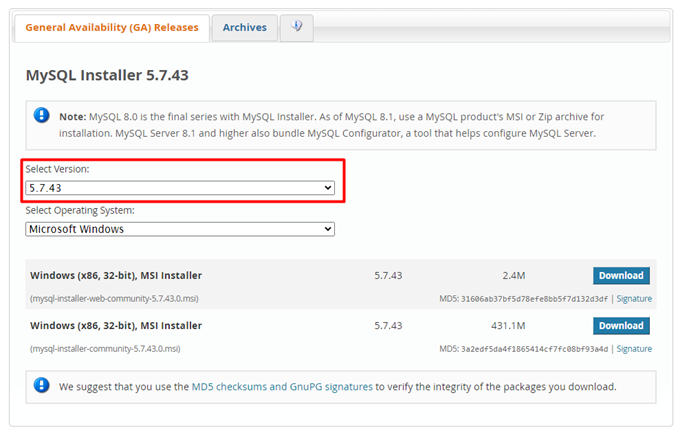
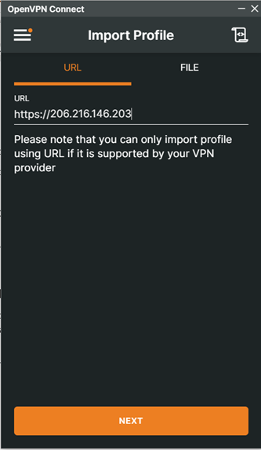
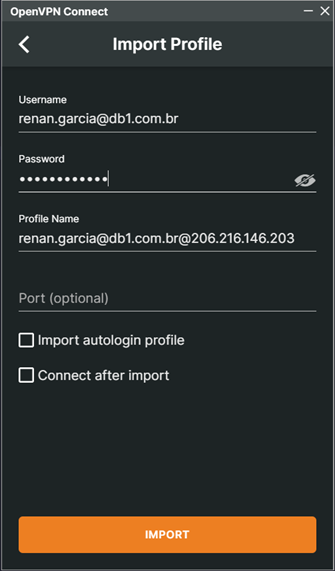

# Onboarding

## Windows admin user

The admin user is used to install new programs. Send a message to an IT team member to request the admin user credentials of your Windows.

## Preparing your local environment

### GIT

Git is a version control system used for tracking changes and controlling the version of our projects. The newest version of Git can be found in https://git-scm.com/downloads. 

### IntelliJ IDEA

The System4 backend is using **Java 8**, then we recommend using the IntelliJ IDEA. This IDEA is an integrated development environment for developing computer software in Java and other JVM-based languages.

The newest version of IntelliJ IDEA Community can be found in https://www.jetbrains.com/idea/download. 

### MySQL

System4 uses the MySQL database. The DBMS for MySQL is the MySQL Workbench. System4 doesn't use the newest version of MySQL, thus you need to download the **version 5.X.X**.

The DBMS for MySQL can be found in  https://dev.mysql.com/downloads/installer/. Select the right version as shown below.



### VS Code

VS Code is a code editor used to manage the frontend code. The newest version of VS Code can be found in https://code.visualstudio.com/download. 

### OpenVPN Connect

System4 has its own VPN. The OpenVPN Connect is used to create a connection with the System4 VPN.

The **version 3.x** of Open VPN Connect can be found in https://openvpn.net/client/client-connect-vpn-for-windows/.

## Configure System4 VPN on OpenVPN Connect

You need to request access to the System4 VPN. Ask your manager to email System4 team requesting your access. System4 team will send you your credentials.

In the OpenVPN Connect, you need to add the System4 host (**206.216.146.203**) and your credentials. See the following images as example.

 &nbsp; 

## GitLab

All System4 projects are maintained in the GitLab. Currently, we are using a common credential to access the projects, clone them, and push our changes.
You can access the GitLab (https://gitlab.com/) using the following credentials:

```
user: s4software
pass: 3AdgFPk4AiemD@z
```
### Projects
When you are logged in the GitLab, you can find the System4 projects. The main projects are described below.
- **System4-New / Servicesync-Java**: Java backend of the FSM system.
- **System4-New / Servicesync UI Angular10**: Angular frontend of the FSM system.
- **System4-New / WOM-Java**: Java backend of the WOM system.
- **System4-New / WOM-UI**: Angular frontend v1 of the WOM system.
- **System4-New / WOM-UI-v2**: Angular frontend v2 of the WOM system.
- **System4-New / ServiceSync – Tooling**: tool responsible to mask the data from production databases.
